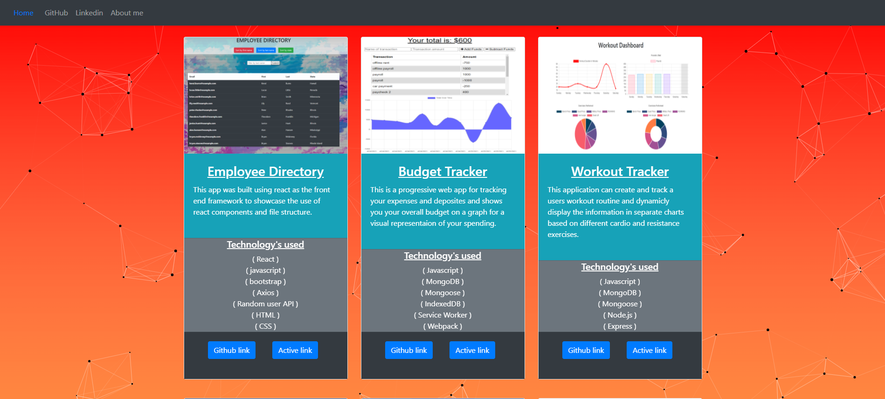

# React-Portfolio

This is my portfolio made to showcase all of the software, projects and code I have created. I was inspired to make this portfolio as a way to document and show my progress as a developer aswell as keeping track of what skills I have learned and need to improve on.

## Bootstrap's Navbar framework - https://getbootstrap.com/docs/5.0/components/navbar/

## Interactive Background - https://vincentgarreau.com/particles.js/

## link to active portfolio website - https://patrick-kaczmar.github.io/React-Portfolio/#/

## License
MIT License - Copyright 2021 Patrick-Kaczmar

